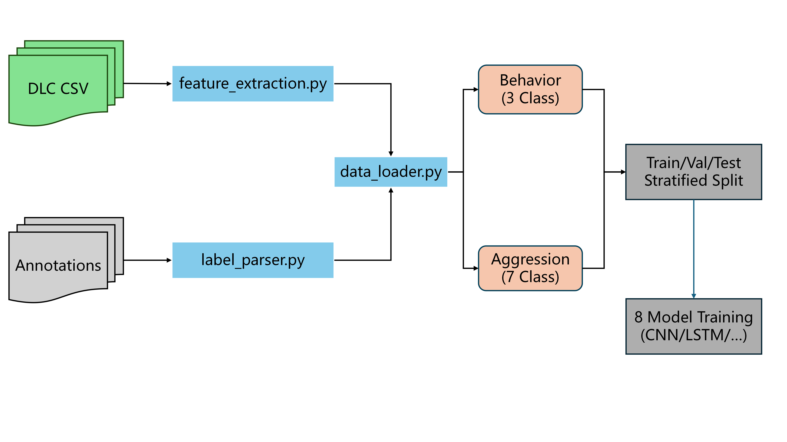

# Rat Behavior Classification

A project focus on rat social behavior classification based on data track using DeepLabCut and Caltech Behavior Annotator labeling

- 📹 Video: https://youtu.be/oTXjbmTi8IQ
- 📊 Dataset DOI: https://doi.org/10.6084/m9.figshare.30393298
- 💻 Environment: Python 3.9–3.11, VS Code / Kaggle

---

## Project Structure

```
Mouse-Behavior-Classifier-Train/
├── README.md                           
├── data/                               
│   ├── dlc_csv/                        
│   │   └── *DLC_*.csv                  
│   ├── annotations/                    
│   │   └── *_annot.txt                 
│   ├── dataset58/                      
│   │   ├── feature8_58.xlsx            
│   │   ├── feature_21.xlsx             
│   │   ├── merged_labels.xlsx          
│   │   └── labels_aggression.xlsx      
│   └── processed/                      
│
├── src/                                
│   ├── __init__.py                     
│   ├── label_parser.py                 
│   ├── feature_extraction.py           
│   ├── data_loader.py                  
│   ├── models.py                       
│   ├── mouse_behavior_classification.ipynb  
│   │
│   └── 8feature_src/                   
│       ├── kaggle_model_comparison.ipynb   
│       ├── CNN.py                      
│       ├── LSTM.py                     
│       ├── GMM.py                      
│       ├── HMM.py                      
│       ├── LightGBM.py                 
│       ├── XGBoost.py                  
│       ├── RandomForest.py             
│       ├── SVM.py                      
│       ├── data_load.py                
│       ├── data_solver.py              
│       ├── config.py                   
│       └── model_comparison_*.py       
│
└── visualization/                      
    └── visualization_*.html            
```

---

## Data Pipeline

### Overview



### Two Feature Mode

| Mode | Feature Num | Code | Data Files | Note |
|------|--------|----------|----------|------|
| **26-feature** | 26 | `src/` | Extracted from DLC in real-time | Full features, extracted from raw DLC CSV |
| **8-feature** | 8 | `src/8feature_src/` | `dataset58/feature8_58.xlsx` | Simplified features, pre-processed Excel |

---

## Experiments

### S1: Behavior Experiment (3-class)
Extracted from S1 annotations, excluding base class:

| Class ID | Name | Description |
|--------|------|------|
| 0 | aggression | Aggressive behavior |
| 1 | social | Social behavior |
| 2 | nonsocial | Non-social behavior |

### S2: Aggression Experiment (7-class)
Extracted from S2 annotations, excluding base class:

| Class ID | Name | Description |
|--------|--------|------|
| 0 | lateralthreat | Lateral threat posture display |
| 1 | keepdown | Pinning opponent down |
| 2 | clinch | Intense physical grappling |
| 3 | uprightposture | Upright confrontation posture |
| 4 | freezing | Motionless state |
| 5 | bite | Biting attack |
| 6 | chase | Chasing opponent |

---

## Features

### 26 Features (Extracted from DLC)

26 features extracted from DLC multi-animal tracking results:

| Category | Count | Feature Names |
|------|------|--------|
| Speed Features | 4 | top1_speed, top2_speed, body1_speed, body2_speed |
| Distance Features | 4 | top_distance, body_distance, top1_tail2_distance, top2_tail1_distance |
| Angle Features | 2 | angle_top1_tail1, angle_top2_tail2 |
| Coordinate Features | 12 | x,y coordinates of 3 main body parts (top, body, tail) for each of 2 mice |
| Interaction Features | 4 | relative_angle, speed_ratio, approach_speed, body_speed_diff |

### 8 Features (Simplified Version)

8 pre-extracted core features for rapid experimentation:
- Distance features (distances between body parts)
- Speed features (movement velocity)
- Angle features (relative angles)

---

## Models

8 supported models:

| Model | Category | Characteristics |
|------|------|------|
| **MLP** | Deep Learning | Multi-layer perceptron, simple and efficient |
| **LSTM** | Deep Learning | Bidirectional LSTM, captures temporal dependencies |
| **CNN** | Deep Learning | 1D CNN, extracts local features |
| **Transformer** | Deep Learning | Attention mechanism, global modeling |
| **LightGBM** | Ensemble Learning | Gradient boosting tree, fast and efficient |
| **XGBoost** | Ensemble Learning | Extreme gradient boosting, robust |
| **RandomForest** | Ensemble Learning | Random forest, prevents overfitting |
| **SVM** | Traditional ML | Support vector machine, suitable for small samples |
| **GMM** | Probabilistic Model | Gaussian mixture model, generative |
| **HMM** | Probabilistic Model | Hidden Markov model, sequence modeling |

---

## Step-by-Step Workflow

### Method 1: 26-Feature Experiment (Full Pipeline)

Using `src/mouse_behavior_classification.ipynb`

```
Step 1: Environment Setup
├── Install dependencies (torch, lightgbm, xgboost, scikit-learn, etc.)
└── Import modules (label_parser, feature_extraction, data_loader, models)

Step 2: Experiment Configuration
├── Select experiment type: EXPERIMENT = "behavior" or "aggression"
├── Set data paths: CSV_FOLDER, ANNOT_FOLDER
└── Set training parameters: N_RUNS, N_EPOCHS, BATCH_SIZE

Step 3: Data Loading and Preprocessing
├── prepare_dataset() loads data
│   ├── Extract 26 features from DLC CSV (feature_extraction.py)
│   ├── Parse annotation files (label_parser.py)
│   └── Align features and labels, filter invalid samples
├── Visualize class distribution
└── Create DataLoader (train/val/test split)

Step 4: Model Training
├── Define training function train_pytorch_model()
├── Iterate through multiple models (MLP, LSTM, CNN, Transformer, LightGBM, etc.)
├── Run each model N_RUNS times (different random seeds)
└── Compute accuracy, weighted_f1, macro_f1

Step 5: Results Visualization
├── Generate model comparison plots (with error bars)
├── Generate Per-Class F1 plots
├── Generate confusion matrices
└── Save statistics tables
```

**代码示例:**
```python
from src import prepare_dataset, create_data_loaders, get_pytorch_model

# 加载数据
X, y, feature_names, class_info = prepare_dataset(
    'data/dlc_csv', 
    'data/annotations',
    experiment='aggression'  # 或 'behavior'
)

# 创建数据加载器
train_loader, val_loader, test_loader, scaler = create_data_loaders(X, y)

# 创建模型
model = get_pytorch_model('mlp', n_features=26, n_classes=7)
```

---

### Method 2: 8-Feature Experiment (Rapid Experimentation)

Using `src/8feature_src/kaggle_model_comparison.ipynb`

```
Step 1: Environment Setup
├── Install dependencies
├── Set LOKY_MAX_CPU_COUNT (Windows compatibility)
└── Check CUDA availability

Step 2: Data Loading
├── Load feature file: feature8_58.xlsx
├── Load label file: merged_labels_aggression.xlsx
└── Align lengths, check class distribution

Step 3: Data Filtering and Mapping
├── EXPERIMENT_MODE = "behavior" or "aggression"
├── Remove class 0 (base class)
├── Remap labels to continuous range [0, n_classes-1]
└── Print class mapping table

Step 4: Model Definition
├── PyTorch models: BehaviorLSTM, BehaviorCNN
├── Traditional ML models: run_gmm_experiment, run_lightgbm_experiment, ...
└── Define compute_metrics() for evaluation metrics

Step 5: Multiple Run Experiments
├── run_multiple_experiments() runs 5 times
├── Each run uses different split_seed
├── Collect accuracy, weighted_f1, macro_f1
└── Compute mean ± std

Step 6: Visualization and Statistics
├── create_comparison_graphs() generates 4 comparison plots
│   ├── overall.png: Overall performance comparison
│   ├── per_class.png: Per-Class F1
│   ├── best_worst.png: Best/Worst class comparison
│   └── stability.png: Stability (coefficient of variation)
└── create_detailed_statistics_table() prints detailed statistics
```

---

## Installation & Usage

### 1. Install Dependencies
```bash
pip install torch lightgbm xgboost scikit-learn pandas numpy matplotlib seaborn hmmlearn openpyxl
```

### 2. Prepare Data
Place DLC CSV files in `data/dlc_csv/` and annotation files in `data/annotations/`

Or download the pre-processed dataset into `data/dataset58/`

### 3. Run Experiments

**26-Feature Experiment:**
```bash
# Run in Jupyter
jupyter notebook src/mouse_behavior_classification.ipynb
```

**8-Feature Experiment:**
```bash
# Run in Jupyter/Kaggle
jupyter notebook src/8feature_src/kaggle_model_comparison.ipynb

# Or run Python script
cd src/8feature_src
python model_comparison_8models.py
```

### 4. Kaggle Usage

Modify data paths in the notebook:
```python
# 8特征实验
feature_file = "/kaggle/input/mouse-behavior/dataset58/feature8_58.xlsx"
label_file = "/kaggle/input/mouse-behavior/dataset58/merged_labels_aggression.xlsx"

# 26特征实验
CSV_FOLDER = "/kaggle/input/mouse-behavior/dlc_csv"
ANNOT_FOLDER = "/kaggle/input/mouse-behavior/annotations"
```

---

## Annotation Format

```
Caltech Behavior Annotator - Annotation File

S1:	start	end	type
-----------------------------
   	1	943	base
   	944	1142	nonsocial
   	1143	1233	social
   	1234	1500	aggression
...

S2:	start	end	type
-----------------------------
   	1	6376	base
   	6377	6441	lateralthreat
   	6442	6500	keepdown
...
```

- **S1**: Behavior层级标注 (base/aggression/social/nonsocial)
- **S2**: Aggression细分标注 (lateralthreat/keepdown/clinch/uprightposture/freezing/bite/chase)

---

## Outputs

### Model Checkpoints
- PyTorch models: `*.pth`
- LightGBM: `*.pkl` (model + scaler)

### Visualization Charts
- `model_comparison_overall.png` - 总体性能对比
- `model_comparison_per_class.png` - Per-Class F1
- `model_comparison_best_worst.png` - 最佳/最差类别
- `model_comparison_stability.png` - 稳定性分析

### Statistics Tables
```
DETAILED STATISTICS TABLE (5 runs, mean ± std)
================================================================================
Model        Accuracy         Weighted F1      Macro F1         ...
--------------------------------------------------------------------------------
GMM          0.3521±0.0156    0.3412±0.0189    0.3156±0.0201    ...
LSTM         0.5623±0.0234    0.5512±0.0267    0.5234±0.0289    ...
CNN          0.5834±0.0198    0.5723±0.0223    0.5456±0.0245    ...
LightGBM     0.6123±0.0145    0.6012±0.0167    0.5789±0.0189    ...
...
```

---

## Reproducibility

- Each experiment runs 5 times with different random seeds (42, 43, 44, 45, 46)
- Stratified split is used to maintain class proportions
- Standardization is fit only on training set to avoid data leakage
- Error bars represent standard deviation (ddof=1)

---

## License

MIT License

---

## Citation

If you use this code or dataset, please cite:

```bibtex
@misc{mouse_behavior_classification,
  author = {Blossom0913},
  title = {Mouse Behavior Classification},
  year = {2024},
  publisher = {GitHub},
  url = {https://github.com/Blossom0913/Mouse-Behavior-Classifier-Train}
}
```

Dataset DOI: https://doi.org/10.6084/m9.figshare.30393298

- Dataset: [https://doi.org/10.6084/m9.figshare.30393298](https://doi.org/10.6084/m9.figshare.30393298.v2)
- Code: add your preferred software citation (e.g., Zenodo DOI if archived)

Example citation format:

```
Author(s). DeepLabVideo: Mouse Behavior Classification (Version YYYY.MM). Repository name. URL
Dataset: Figshare. DOI: 10.6084/m9.figshare.30393298
```

## License

Specify your license here (e.g., MIT). If none is provided, all rights reserved by default.
